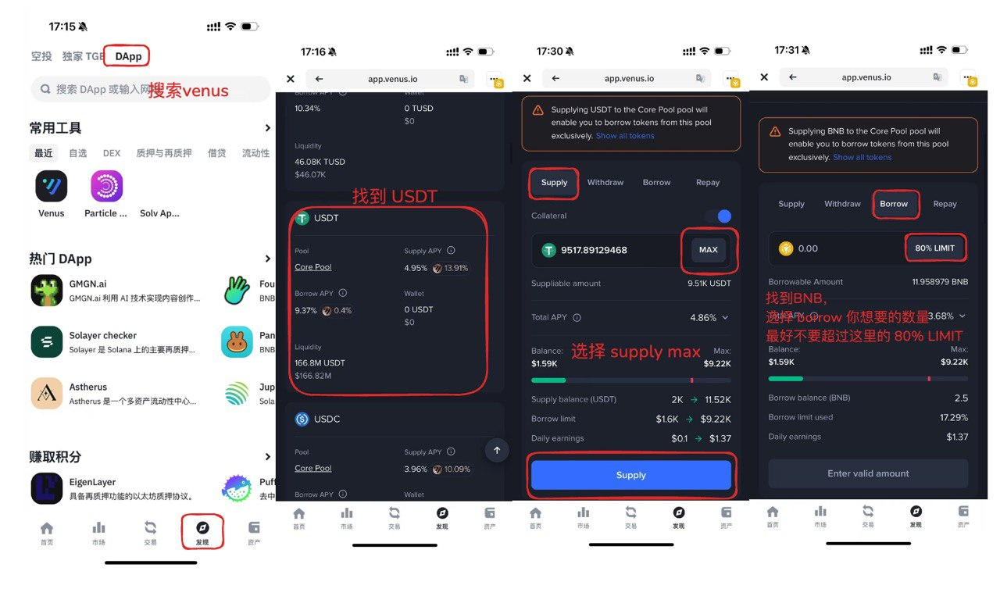

# 币安 TGE 简明教程（钱包开通 → 准备 BNB → 参与 → 领取）

YB-TGE教程：币安又发打新福利了，预计打满3BNB获益200-400U，由于本次TGE不扣积分，即便只有0.1个BNB也建议参加。本教程教你如何开通钱包，**如何准备BNB（从Venus借BNB或从朋友借BNB）**、如何存入 **TGE活动** 并在结束后 **领取分配（Claim）**。

## 详细教程

### 1. 开通币安钱包
- 打开币安 App → 顶部「钱包」进入，如果以前没有开通会提示你开通，按提示一步步完成即可。

### 2. 领取「手续费优惠」福利
- 进入「邀请好友」- 点击底部的「输入邀请码，立减10%」链接，粘贴邀请码：**DDDDAO**
- 电脑端可以直接访问：https://web3.binance.com/referral?ref=DDDDAO

### 3. 准备 BNB（2 选 1）

#### 方法一：通过 Venus 借 BNB
- 先存入抵押物USDT（约需6000 USDT），然后借出BNB
- 注意抵押率不要超过60%
  

#### 方法二：向朋友借 3 BNB
- 如果自己没有U，可以找信任的朋友合作，借3个BNB

### 4. 参与 TGE 存入
- 16:00活动开始 → 钱包首页点击 TGE 横幅进入
- 连接 Web3 钱包
- 输入存入金额（上限 3 BNB）
- 点击「DEPOSIT」确认存入

### 5. 领取流程
- **18:00 后**开始领取
- 取回 BNB
- 领取空投的 KEY
- 可在15号卖出 YB

## 关键信息

- **不扣积分**：本次 TGE 不消耗积分
- **预期收益**：200-400 USDT（满额3 BNB）
- **最低参与**：即便只有 0.1 BNB 也建议参加
- **最大存入**：每账户最多 3 BNB

## 常见问题 FAQ

### 认购确认时间
- 存入后约 2 小时进行认购确认

### 领取时间
- 18:00 后可以开始领取

### 存入上限
- 每个账户最多存入 3 BNB

### 超额认购
- 如果超额认购，会按比例退回部分 BNB
